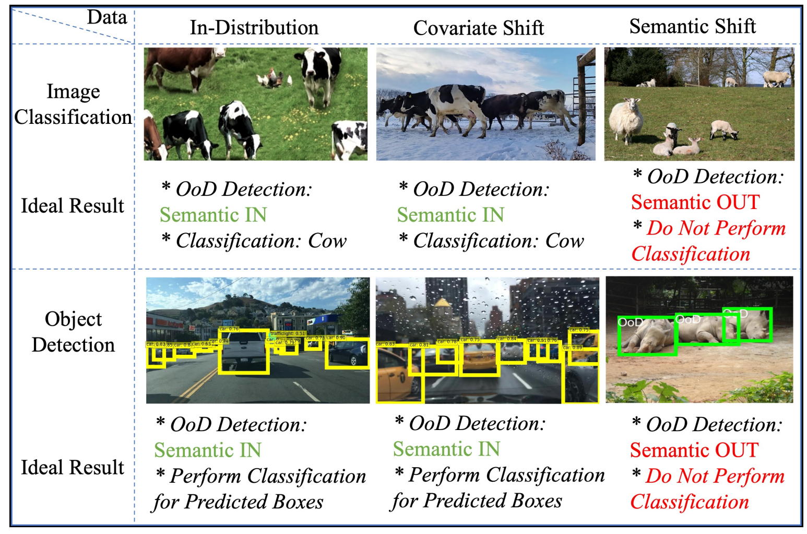
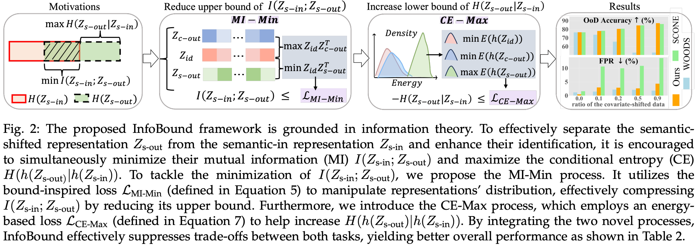
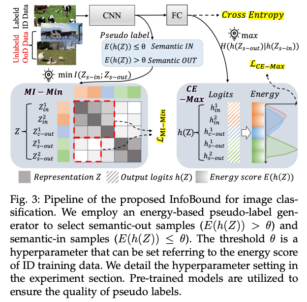
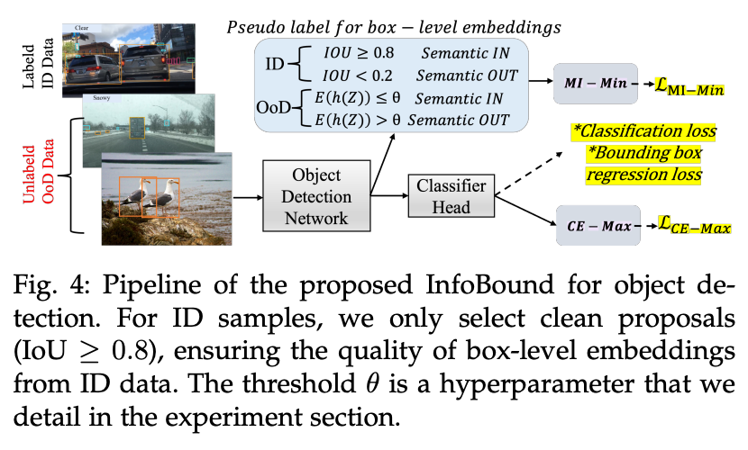
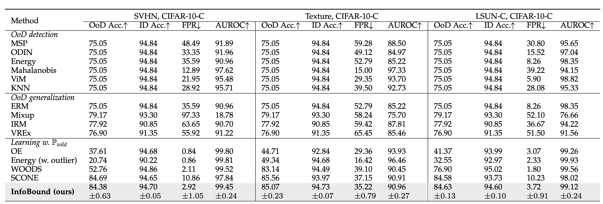
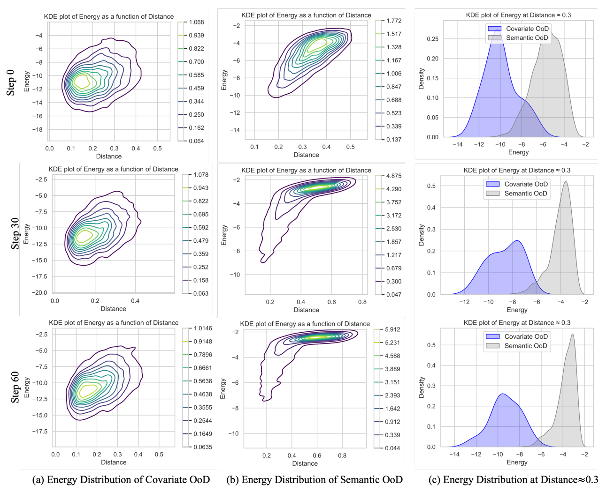

## InfoBound: A Provable Information-Bounds Inspired Framework for Both OoD Generalization and OoD Detection

Official implementation of [InfoBound: A Provable Information-Bounds Inspired Framework for Both OoD Generalization and OoD Detection ](https://ieeexplore.ieee.org/abstract/document/11112669) The paper has been accepted by T-PAMI 2025.

### Ads

Checkout our NeurIPS 2025 work：ΔEnergy: Optimizing Energy Change During Vision-Language Alignment Enhances both OOD  Detection and OOD Generalization.

ICML 2024 work [CRoFT: Robust Fine-Tuning with Concurrent Optimization for OOD Generalization and Open-Set OOD Detection (openreview.net)](https://openreview.net/pdf?id=xFDJBzPhci) if you are interested in concurrent optimzaition for OOD generalzaition and OOD detection!

### Abstract

In real-world scenarios, distribution shifts give rise to the importance of two problems: out-of-distribution (OoD) generalization, which focuses on models’ generalization ability against covariate shifts (i.e., the changes of environments), and OoD detection, which aims to be aware of semantic shifts (i.e., test-time unseen classes). Realworld testing environments often involve a combination of both covariate and semantic shifts. While numerous methods have been proposed to address these critical issues, only a few works tackled them simultaneously. Moreover, prior works often improve one problem but sacrifice the other. To overcome these limitations, we delve into boosting OoD detection and OoD generalization from the perspective of information theory, which can be easily applied to existing models and different tasks. Building upon the theoretical bounds for mutual information and conditional entropy, we provide a unified approach, composed of Mutual Information Minimization (MI-Min) and Conditional Entropy Maximizing (CE-Max). Extensive experiments and comprehensive evaluations on multi-label image classification and object detection have demonstrated the superiority of our method. It successfully mitigates trade-offs between the two challenges compared to competitive baselines.

### Topic



**Illustration of three types of data encountered in various tasks when deploying models in the open world:** (i) in-distribution data (e.g., driving data in clear weather), (ii) covariate-shifted data (e.g., driving data in rainy weather), and (iii) semantic-shifted data (e.g., hippopotamus). Leveraging the labeled in-distribution (ID) data and the freely available unlabeled OoD data, our framework improved both OoD generalization and OoD detection.

### Motivation



### Pipeline



### How to run

This code of image classification is built on top of the awesome [SCONE](https://github.com/deeplearning-wisc/scone) . For dataset preparation and pretrained models, please refer to the [SCONE](https://github.com/deeplearning-wisc/scone) repository.

To run the code, execute:

```bash
# run_infoboun.sh infobound in_distribution aux_distribution test_distribution pi_1 pi_2 gpu_id seed infobound_threshold
bash run_infobound.sh mm_energy cifar10 svhn svhn 0.5 0.1 0 1 0.5
```
You can adjust `mutual_info1_coeff`, `mutual_info2_coeff`, and `mm_energy_threshold` as needed to influence the training outcome.
To extract and visualize the latent features during the training process,  please set `script=train_embd.py` in the `run_infobound.sh` file.

### To do:

1.Release the code of CLIP-based experiments

2.Release the code of object detection

### Results

**Main results: comparison with competitive OoD generalization and OoD detection methods on CIFAR-10.** Our experiments show that InfoBound outperforms the state-of-the-art method SCONE in OoD detection, achieving a significant reduction of around 5.5% in FPR, while maintaining comparable OoD generalization results.





**Energy visualization for the covariate-shifted and semantic-shifted OoD data across different nearest distances to the ID data.** We also present the energy distribution when the nearest distance between the OoD sample and the ID samples is approximately 0.3. From the second row in the figure, as InfoBound training progresses, the energy distribution of the semantic-shifted OoD data becomes more concentrated in the upper-right corner. This indicates that the latent features of semantic-shifted OoD move away from the semantic-in data (as a result of MI-Min), and the energy scores of semanticshifted OoD gradually increase (as a result of CE-Max).

### Citation

If you use this code in your research, please kindly cite the following papers:

```
@article{zhu2025infobound,
  title={InfoBound: A Provable Information-Bounds Inspired Framework for Both OoD Generalization and OoD Detection},
  author={Zhu, Lin and Yang, Yifeng and Nie, Zichao and Gao, Yuan and Li, Jiarui and Gu, Qinying and Wang, Xinbing and Zhou, Chenghu and Ye, Nanyang},
  journal={IEEE Transactions on Pattern Analysis and Machine Intelligence},
  year={2025},
  publisher={IEEE}
}

@article{zhu2024croft,
  title={CRoFT: Robust Fine-Tuning with Concurrent Optimization for OOD Generalization and Open-Set OOD Detection},
  author={Zhu, Lin and Yang, Yifeng and Gu, Qinying and Wang, Xinbing and Zhou, Chenghu and Ye, Nanyang},
  journal={arXiv preprint arXiv:2405.16417},
  year={2024}
} 
```

### Contact 

If you have any questions about this project, please feel free to contact [zhulin_sjtu@sjtu.edu.cn](mailto:zhulin_sjtu@sjtu.edu.cn).
